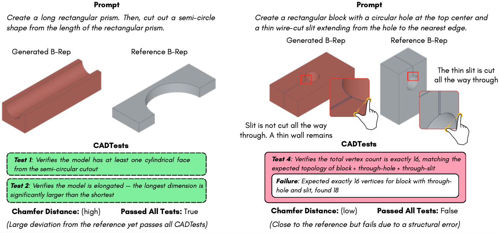
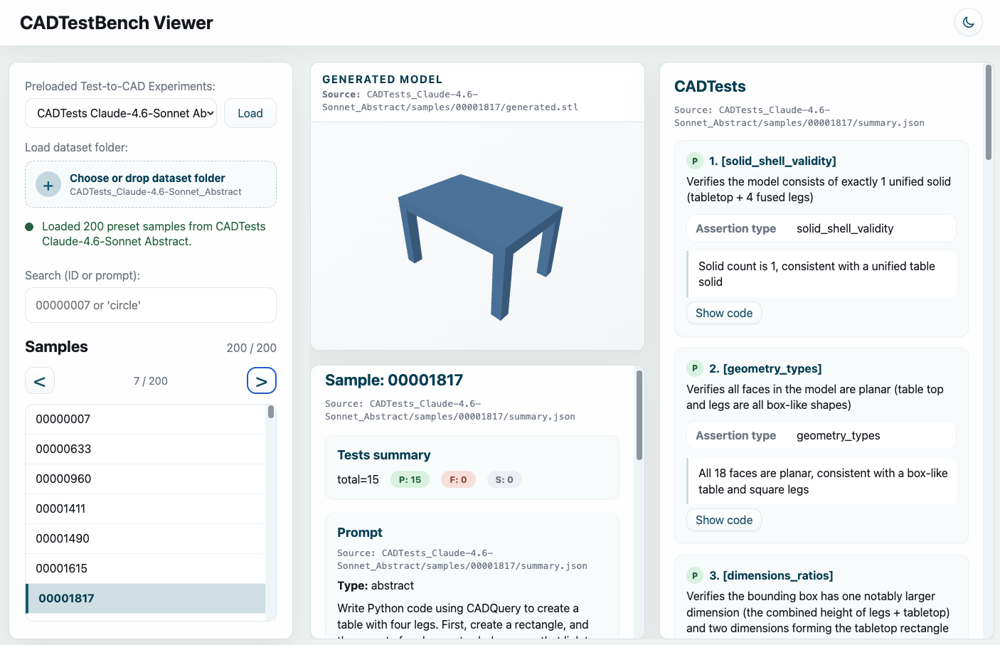

# Text-to-CAD Evaluation with CADTests

### [Dimitrios Mallis](https://dimitrismallis.github.io/), [Marco Wang](https://marcowang.tech/), [Ahmet Serdar Karadeniz](https://askaradeniz.github.io/), [Elisa Ricci](https://eliricci.eu/), [Anis Kacem](https://www.uni.lu/en/person/NTAwMzU1NDVfX0FuaXMgS0FDRU0=/), [Djamila Aouada](https://www.uni.lu/snt-en/people/djamila-aouada/)

This repository contains the CADTestBench, the first test-based benchmark for Text-to-CAD, along with code for evaluating any Text-to-CAD method against CADTestBench and for computing dataset metrics.

CADTestBench is described on the paper:

> __Text-to-CAD Evaluation with CADTests__.

The benchmark data is loaded from Hugging Face by default ([`dimitrismallis/CADTestBench`](https://huggingface.co/datasets/dimitrismallis/CADTestBench)).

## CADTestBench

**A test-based benchmark for Text-to-CAD evaluation.**

CADTestBench replaces geometric-similarity metrics (e.g., Chamfer Distance) with executable software tests that directly verify whether a generated CAD model satisfies the geometric and topological requirements of its prompt. Each prompt is paired with a suite of **CADTests** — Python predicates over the generated B-rep — and a model is correct only if it passes every test.




### Why test-based evaluation?

Text prompts are inherently ambiguous: many valid CAD models can satisfy the same prompt. Comparing a generation to a single reference via geometric similarity penalizes valid design variations and rewards superficially close but structurally wrong outputs. Test-based evaluation is:

- **Reference-free** — assesses prompt compliance directly, not similarity to one ground-truth solution.
- **Explicit** — every dimensional and structural requirement is a checkable constraint.
- **Interpretable** — failing tests return diagnostic messages explaining what went wrong.
- **Efficient** — deterministic, fast, no inference cost from learned evaluators.

### What's in the benchmark

- 200 CAD programs sourced from [CADPrompt](https://github.com/Kamel773/CAD_Code_Generation)
- Two prompt variants per program: *abstract* (high-level description) and *detailed* (with explicit geometric constraints)
- A suite of CADTests per prompt, synthesized and refined through mutation analysis
- Per-test metadata: requirement linkage, test type, classification rationale

## Installation

Use a **dedicated virtual environment** for this repo so CadQuery and its dependencies.

Requires **Python 3.10+**. From the repository root:

```bash
python3 -m venv cadtestenv
source cadtestenv/bin/activate 
pip install --upgrade pip setuptools wheel
pip install -e . --timeout 120 --retries 10
```


## Quick Start in Browser

Open **[CADTestBench Viewer](https://cadtestbench-viewer.vercel.app/)** for four paper baselines (GPT-5.2 and Claude 4.6 Sonnet, abstract and detailed splits) with **preloaded** cadtest results. Browse directly in the browser.

[](https://cadtestbench-viewer.vercel.app/)

## Run Paper Baselines

The repo includes four paper baselines (GPT-5.2 and Claude 4.6 Sonnet, abstract and detailed splits). From the project root, after `pip install -e .`, run:

```bash
cadtestbench evaluate baselines/GPT-5.2/Abstract --partition abstract
cadtestbench evaluate baselines/GPT-5.2/Detailed --partition detailed
cadtestbench evaluate baselines/Claude-4.6-Sonnet/Abstract --partition abstract
cadtestbench evaluate baselines/Claude-4.6-Sonnet/Detailed --partition detailed
```

Each command loads prompts and cadtests from [`dimitrismallis/CADTestBench`](https://huggingface.co/datasets/dimitrismallis/CADTestBench). Use `--limit N` for a short run.

## Usage

To evaluate a Text-to-CAD method with CADTestBench, load the benchmark prompts from Hugging Face ([`dimitrismallis/CADTestBench`](https://huggingface.co/datasets/dimitrismallis/CADTestBench)), then produce your method’s outputs in the directory layout described below.

### Method Result layout (generated models)

Pass a **method run root** as the positional `BASELINE_DIR`. Under it, each benchmark sample id is a folder:

```
{BASELINE_DIR}/
└── generated_models/
    └── {sample_id}/
        └── gpt_generated.py      # default; other names via metric kwargs
```

**Convention in this repo’s baselines:** implement geometry in **`create_cad()`** (returns the model, usually `cq.Workplane`), then assign **`final_result`** at module scope so the runner can load it:

```python
import cadquery as cq

def create_cad() -> cq.Workplane:
    result = cq.Workplane("XY").circle(10).extrude(20)
    return result

final_result = create_cad()
```

### Evaluation

- **Partition** — **`--partition` is required:** `abstract` or `detailed`.

```bash
cadtestbench evaluate path/to/method --partition abstract
```

More flags: `--limit`, `--sample-ids`, `--dataset`, `--run-label`, `--eval-root` — see `cadtestbench evaluate --help`.

```bash
cadtestbench evaluate path/to/method --partition detailed --limit 10
```

## Evaluation output

Each run is written under `eval_root` (default `{project_root}/eval`) in a timestamped folder:

```
{eval_root}/
└── {YYYYMMDD_HHMMSS}_…_{partition}/
    ├── config.json                 # resolved run configuration
    ├── evaluation_summary.json     # aggregate metrics and timing
    └── samples/
        └── {sample_id}/
            ├── summary.json          # per-sample metrics and metadata
            ├── generated.stl         # mesh from the generated model
            └── code_with_cadtests.py # optional replay bundle (debug)
```

Inspect runs in **[CADTestBench Viewer](https://cadtestbench-viewer.vercel.app/)** by dragging the timestamped folder (`{YYYYMMDD_HHMMSS}_…_{partition}/`, the one that contains `config.json`, `evaluation_summary.json`, and `samples/`) into the page.


## The `cadtest` metrics

For each sample, `cadtest`:

1. Loads the cadtest suite for the sample from the configured Hugging Face dataset.
2. Executes the generated model code.
3. Runs each cadtest against the live CadQuery object.
4. Combines results to compute reported metrics.


## Hugging Face

CADTestBench is loaded from **[dimitrismallis/CADTestBench](https://huggingface.co/datasets/dimitrismallis/CADTestBench)** by default.

## License

MIT — see [`LICENSE`](LICENSE).

## Citation

If you find this work useful for your research, please cite our paper:

```
@article{mallis2026cadtests,
  title={Text-to-CAD Evaluation with CADTests},
  author={Dimitrios Mallis and Marco Wang and Ahmet Serdar Karadeniz and Elisa Ricci and Anis Kacem and Djamila Aouada},
  journal={arXiv preprint arXiv:2605.07807},
  year={2026}
}
```
